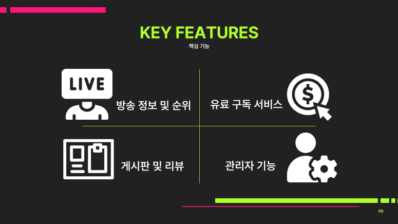

# team-no-sigh

## 프로젝트 소개

스트리머 센서는 다양한 방송 플랫폼을 사용자가 순회, 검색하는 번거로움을 줄여주고
사용자의 요청사항에 맞는 방송 정보를 쉽게 확인할 수 있는 스트리밍 영상 추천 사이트입니다.

### 유튜버와 영상 추천 서비스

    - ajax, api 활용하여 영상 추천
    - 스트리머에게 별점 남기기

## 핵심 기능

## 기술 스택

## ERD

## 실행 방법

1. StreamerSensor0302 파일 압축 해제
2. 이클립스의 open project 혹은 인텔리제이의 프로젝트 열기로 폴더 지정
3. 임포트 된 프로젝트를 실행.
